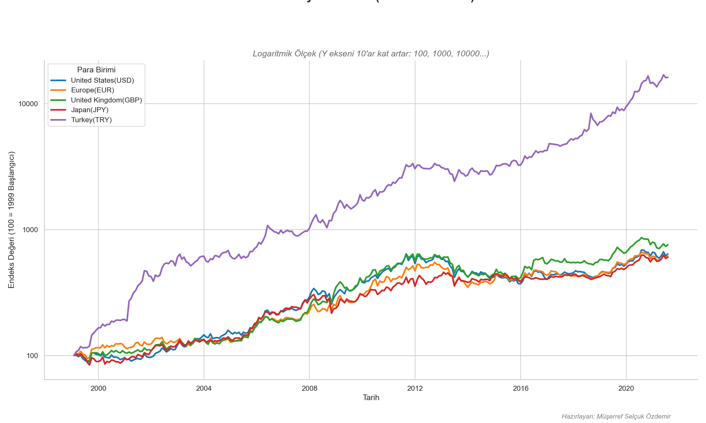

# Gold Prices Analysis

This project analyzes the performance of 1 Ounce of Gold against a selection of key currencies from January 1999 to July 2021.

## Analysis

The analysis is performed in the `notebooks/02_gorsellestirme_ve_sonuc.ipynb` notebook.

The main goal is to answer the question: "If the price of 1 Ounce of Gold was '100 units' at the beginning of 1999, what would its value be today in different currencies?"

### Key Currencies

The analysis focuses on the following currencies:
- United States (USD)
- Europe (EUR)
- United Kingdom (GBP)
- Japan (JPY)
- Turkey (TRY)

### Methodology

1.  **Data Loading:** The data is loaded from `data/1979-2021.csv`.
2.  **Data Filtering:** The dataset is filtered to include data from January 1, 1999, onwards.
3.  **Indexing:** The price of gold in each currency is indexed to a baseline of 100 as of January 1999.
4.  **Visualization:** A line plot is generated to visualize the change in the indexed price of gold over time for each currency. A logarithmic scale is used on the y-axis to accommodate the wide range of values.

## Results

The final visualization shows the relative performance of each currency against gold.



## How to Run

1.  Install the required Python packages:
    ```
    pip install -r requirements.txt
    ```
2.  Run the Jupyter Notebook:
    ```
    jupyter notebook notebooks/02_gorsellestirme_ve_sonuc.ipynb
    ```